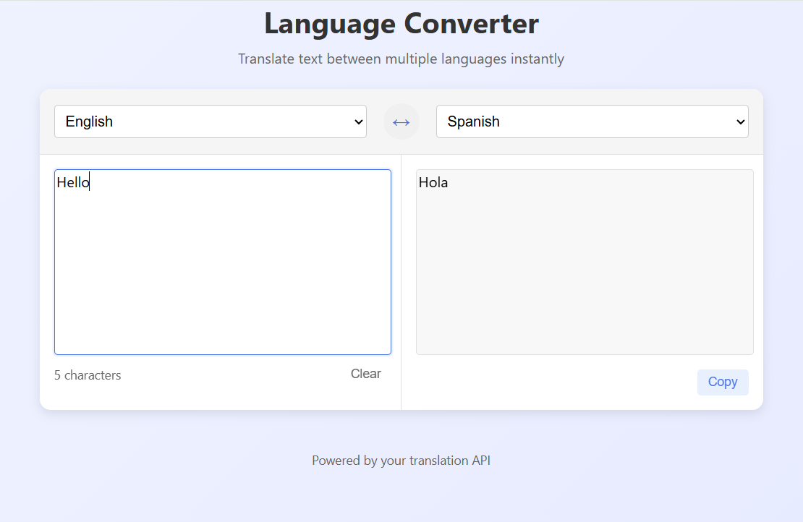

# 🌐 Multilingual Translation App

This project is a full-stack application that allows users to translate text between multiple languages using a self-hosted translation API.

## 🧰 Tech Stack

- **Frontend**: React, TypeScript
- **Backend API**: [LibreTranslate](https://libretranslate.com/) hosted locally via Docker
- **Languages Supported**: English, Spanish, Hindi ()

---
🚧 Note: This project is a work in progress. More languages and features are being added gradually.

